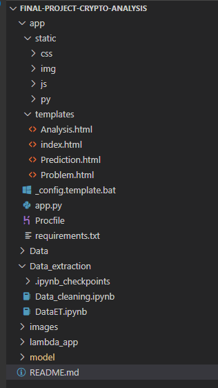
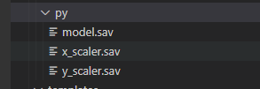
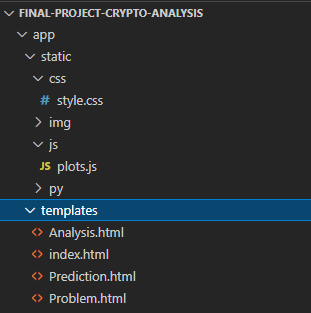
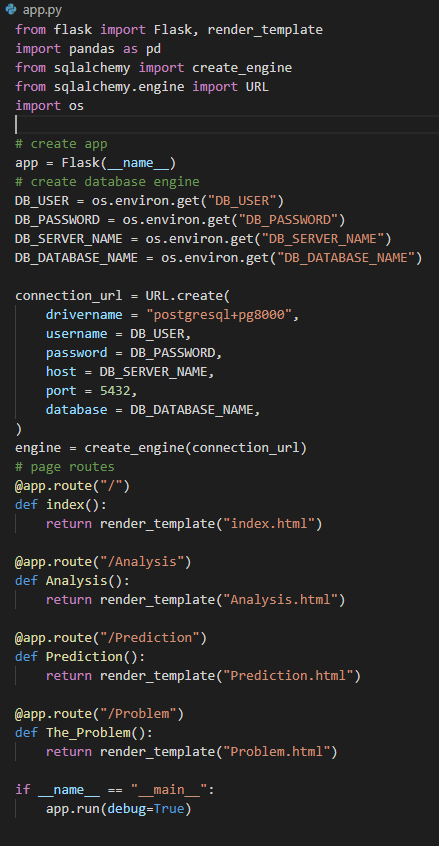

# Cryptocurrency Analysis Project

## Introduction
The aim of this project is to have a basic understanding of the cryptocurrency, what is it? the History behind it/
Then dive into some more analysis to find top ranking cryptos from a historica dataset .
Finally with this basic understanding , find whether there is a correlation between Bitocoin, stocks (for example i have taken TESLA prices) and Gold market

For the prediction challenge of this project, i have tried prediction using Linear Regression and LSTM (Long Shart-Term Memory)
## Creation of new anaconda environment

Created a new conda environment 'Crypto-Analysis' to start with the project and added some necessary folders.
the following folders were setup as suggested as I progressed with the project

## Data extraction

 Data was extracted from 

  qandl
  kaggle (for historical dataset - Tableau analysis)
  yahoo finance (yfinance)

## Data transformation and loading

 Step 1 : After data extraction, data was cleaned and transformed and saved into a csv file 'BTC.csv'.

Step 2 : On the AWS cloud, created a RDS and S3 bucket. 

Step 3 : Loaded the BTC.csv file into the S3 bucket

Step 4 : set up the necessary config file '_config.template.bat

Step 5 : Created tabels in postgres

Step 6 : tested data load locally

Step 7 : changed enpoint settings and deployed the ETL to AWS Lambda

## Data Analysis

Data Analyis has been done using Tableau.
Following are the tableau files published in Tableau Public

1. Top currencies with ranking 2013-2018

* [top currencies](https://public.tableau.com/views/popularcurrencies2018/Dashboard2?:language=en-GB&:display_count=n&:origin=viz_share_link)

2. Scatterplot correlation of BTC,TSLA,Gold

* [scatterplot](https://public.tableau.com/views/Scatterplotcorrelation/Dashboard1?:language=en-GB&:display_count=n&:origin=viz_share_link)

3. Correlation between some famous cryptocurrencies

* [Correlation matrix](https://public.tableau.com/views/correlation_matrixdashboard/Dashboard3?:language=en-GB&:display_count=n&:origin=viz_share_link)

4. LSTM chart using actual and predicted data from csv file

* [lstm](https://public.tableau.com/views/LSTMchart/Dashboard1?:language=en-GB&:display_count=n&:origin=viz_share_link)

## Machine Learning

Machine learning model was created and test and train data was scaled and saved in the below folder

##  Prediction

Prediction was applied using Linear regression and LSTM model
here are the .ipynb files  for reference

* [linear regression](model/prediction_Linearreg.ipynb)

* [LSTM](model/LSTM.ipynb)

## HTML AND CSS
The folowing  web pages were created to put everything together 

## flask app
flask app creation code 'app.py'

 

## AWS Beanstalk deployment

Step 1 : stored the commands into build.bat and run the file to crea a zip file 

Step2 : Created an application in Elastic Beanstalk and configured it as per the instuctions given.

please click the following link to view the app.

* [AWS app Elastic Beanstalk](http://allthatglitters-env.eba-hpqmey4i.ap-southeast-2.elasticbeanstalk.com/index)

## Requirements

click on the below lik for requirements.txt

* [requirements.txt](app/requirements.txt)

# .................The End.....................

